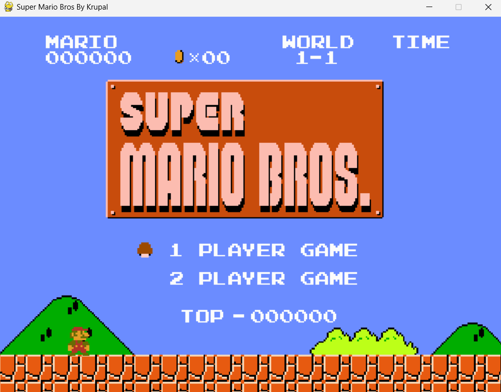

# README
* You can use my code (give credit atleast)

# Requirement
* Python 3.7
* pygame==2.1.3.dev8
(pip install pygame)

# How To Start Game
$ python main.py

# Screenshot
* Here I have project screenshot :

# How to Play(Noobde Sale)

* use LEFT/RIGHT/DOWN key to control player
* use key 'Space' to jump
* use key 's' to shoot firewall or run

# Credit 

*Thanks to chatgpt,google & original devs of mario🤣
